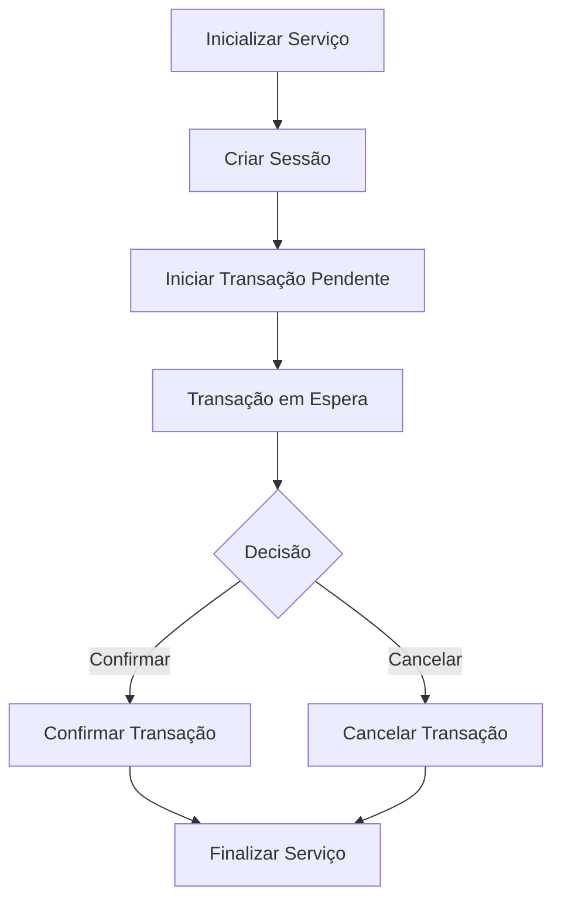

# Agente CliSiTef - SDK Flutter

SDK Flutter para integração com AgenteCliSiTef, baseado na especificação oficial CliSiTef versão 248. Este SDK permite a integração de aplicações Flutter com sistemas de pagamento via CliSiTef, incluindo funcionalidades avançadas como **Captura Tardia** para transações pendentes.

## 📋 Índice

- [Visão Geral](#visão-geral)
- [Instalação](#instalação)
- [Configuração](#configuração)
- [Serviços Disponíveis](#serviços-disponíveis)
- [Captura Tardia](#captura-tardia)
- [Exemplos de Uso](#exemplos-de-uso)
- [Tratamento de Erros](#tratamento-de-erros)
- [API Reference](#api-reference)
- [Contribuição](#contribuição)

## 🎯 Visão Geral

O SDK Agente CliSiTef oferece uma interface completa para integração com sistemas de pagamento via CliSiTef, incluindo:

- **Transações de Pagamento**: Processamento de pagamentos com cartão
- **Transações Gerenciais**: Operações administrativas
- **Captura Tardia**: Sistema para transações pendentes de confirmação
- **Serviços PinPad**: Interação com dispositivos de entrada
- **Tratamento de Erros**: Sistema robusto de exceções


## ⚙️ Configuração

### Configuração Básica

```dart
import 'package:agente_clisitef/agente_clisitef.dart';

// Configuração para desenvolvimento
final config = CliSiTefConfig.development(
  sitefIp: '192.168.1.100',
  storeId: '00000001',
  terminalId: '00000001',
);

// Configuração para produção
final config = CliSiTefConfig.production(
  sitefIp: '192.168.1.100',
  storeId: '00000001',
  terminalId: '00000001',
  baseUrl: 'https://seu-servidor.com',
  timeout: Duration(seconds: 30),
);
```

### Parâmetros de Configuração

| Parâmetro | Descrição | Obrigatório |
|-----------|-----------|-------------|
| `sitefIp` | IP do servidor SiTef | ✅ |
| `storeId` | ID da loja (8 dígitos) | ✅ |
| `terminalId` | ID do terminal (8 caracteres) | ✅ |
| `baseUrl` | URL do AgenteCliSiTef | ❌ |
| `timeout` | Timeout das requisições | ❌ |
| `enableLogs` | Habilitar logs detalhados | ❌ |

## 🔧 Serviços Disponíveis

### 1. CliSiTefCoreService
Serviço principal para transações básicas.

### 2. CliSiTefPinPadService
Serviço para interação com dispositivos PinPad.

### 3. CliSiTefServiceAgente
Serviço para operações com AgenteCliSiTef.

### 4. CliSiTefServiceCapturaTardia ⭐
**Serviço especializado para transações pendentes de confirmação.**

## 🎯 Captura Tardia

O serviço de **Captura Tardia** é uma funcionalidade avançada que permite iniciar uma transação e decidir posteriormente se confirmar ou cancelar. Isso é especialmente útil em cenários onde:

- O cliente precisa confirmar o pagamento após a transação
- Há necessidade de validação manual antes da confirmação
- Sistemas de totem de auto-atendimento
- Transações que dependem de confirmação externa

### Características Principais

- ✅ **Transação Pendente**: Inicia sem finalizar automaticamente
- ✅ **Confirmação Manual**: Permite confirmar ou cancelar posteriormente
- ✅ **Controle de Sessão**: Mantém a sessão ativa para operações subsequentes
- ✅ **Tratamento de Erros**: Sistema robusto de exceções
- ✅ **Logs Detalhados**: Rastreamento completo das operações

### Fluxo de Captura Tardia



## 💻 Exemplos de Uso

### Exemplo 1: Transação Básica com Captura Tardia

```dart
import 'package:agente_clisitef/agente_clisitef.dart';

void main() async {
  // 1. Configurar o serviço
  final config = CliSiTefConfig.development(
    sitefIp: '192.168.1.100',
    storeId: '00000001',
    terminalId: '00000001',
  );

  final service = CliSiTefServiceCapturaTardia(config: config);

  try {
    // 2. Inicializar o serviço
    await service.initialize();
    print('Serviço inicializado com sucesso');

    // 3. Preparar dados da transação
    final transactionData = TransactionData.payment(
      functionId: 110, // Código da função
      trnAmount: 50.00,
      taxInvoiceNumber: 'CUPOM001',
      taxInvoiceDate: DateTime.now(),
      taxInvoiceTime: DateTime.now(),
    );

    // 4. Iniciar transação pendente
    final pendingTransaction = await service.startPendingTransaction(transactionData);
    
    if (pendingTransaction != null) {
      print('Transação pendente criada: ${pendingTransaction.sessionId}');
      
      // 5. Simular processo de decisão
      await Future.delayed(Duration(seconds: 5));
      
      // 6. Confirmar a transação
      final result = await pendingTransaction.confirm();
      
      if (result.isServiceSuccess) {
        print('Transação confirmada com sucesso!');
      } else {
        print('Erro ao confirmar: ${result.errorMessage}');
      }
    }

  } catch (e) {
    print('Erro: $e');
  } finally {
    // 7. Finalizar o serviço
    await service.dispose();
  }
}
```

### Exemplo 2: Transação com Cancelamento

```dart
void exemploCancelamento() async {
  final config = CliSiTefConfig.development();
  final service = CliSiTefServiceCapturaTardia(config: config);

  try {
    await service.initialize();

    final transactionData = TransactionData.payment(
      functionId: 110,
      trnAmount: 25.50,
      taxInvoiceNumber: 'CUPOM002',
      taxInvoiceDate: DateTime.now(),
      taxInvoiceTime: DateTime.now(),
    );

    final pendingTransaction = await service.startPendingTransaction(transactionData);
    
    if (pendingTransaction != null) {
      // Simular cancelamento
      final result = await pendingTransaction.cancel();
      
      if (result.isServiceSuccess) {
        print('Transação cancelada com sucesso!');
      }
    }

  } catch (e) {
    print('Erro: $e');
  } finally {
    await service.dispose();
  }
}
```

### Exemplo 3: Transação com Dados Personalizados

```dart
void exemploDadosPersonalizados() async {
  final config = CliSiTefConfig.development();
  final service = CliSiTefServiceCapturaTardia(config: config);

  try {
    await service.initialize();

    final transactionData = TransactionData.payment(
      functionId: 110,
      trnAmount: 100.00,
      taxInvoiceNumber: 'CUPOM003',
      taxInvoiceDate: DateTime.now(),
      taxInvoiceTime: DateTime.now(),
      trnAdditionalParameters: {
        'param1': 'valor1',
        'param2': 'valor2',
      },
      trnInitParameters: {
        'init1': 'valor1',
        'init2': 'valor2',
      },
    );

    final pendingTransaction = await service.startPendingTransaction(transactionData);
    
    if (pendingTransaction != null) {
      // Continuar com dados específicos
      final result = await pendingTransaction.continueWithData(
        command: 1,
        data: 'dados_especificos',
      );
      
      // Confirmar após processamento
      await pendingTransaction.confirm();
    }

  } catch (e) {
    print('Erro: $e');
  } finally {
    await service.dispose();
  }
}
```

## 🚨 Tratamento de Erros

O SDK utiliza um sistema robusto de exceções para tratar diferentes tipos de erros:

### Tipos de Exceção

```dart
try {
  await service.startPendingTransaction(data);
} on CliSiTefException catch (e) {
  switch (e.code) {
    case -2:
      print('Operador cancelou a operação');
      break;
    case -6:
      print('Usuário cancelou no pinpad');
      break;
    case -15:
      print('Sistema cancelou automaticamente');
      break;
    default:
      print('Erro desconhecido: ${e.message}');
  }
} catch (e) {
  print('Erro inesperado: $e');
}
```

### Códigos de Erro Comuns

| Código | Descrição |
|--------|-----------|
| -2 | Operador cancelou a operação |
| -6 | Usuário cancelou no pinpad |
| -15 | Sistema cancelou automaticamente |
| -1 | Erro de comunicação |
| -3 | Erro de configuração |

## 📚 API Reference

### CliSiTefServiceCapturaTardia

#### Métodos Principais

```dart
class CliSiTefServiceCapturaTardia {
  // Inicializar o serviço
  Future<bool> initialize();
  
  // Iniciar transação pendente
  Future<CapturaTardiaTransaction?> startPendingTransaction(TransactionData data);
  
  // Verificar conectividade
  Future<bool> checkConnectivity();
  
  // Finalizar o serviço
  Future<void> dispose();
}
```

#### Propriedades

```dart
// Verificar se está inicializado
bool get isInitialized;

// ID da sessão atual
String? get currentSessionId;

// Configuração
CliSiTefConfig get config;

// Versão do SDK
String get version;
```

### CapturaTardiaTransaction

#### Métodos

```dart
class CapturaTardiaTransaction {
  // Confirmar a transação
  Future<TransactionResponse> confirm({
    String? taxInvoiceNumber,
    DateTime? taxInvoiceDate,
    DateTime? taxInvoiceTime,
  });
  
  // Cancelar a transação
  Future<TransactionResponse> cancel({
    String? taxInvoiceNumber,
    DateTime? taxInvoiceDate,
    DateTime? taxInvoiceTime,
  });
  
  // Continuar com dados específicos
  Future<TransactionResponse> continueWithData({
    required int command,
    String? data,
  });
}
```

#### Propriedades

```dart
// Verificar se foi finalizada
bool get isFinalized;

// ID da sessão
String get sessionIdValue;

// Resposta original
TransactionResponse get originalResponse;

// Campos mapeados
CliSiTefResponse get fields;
```

## 🔧 Configuração Avançada

### Configuração com SSL

```dart
final config = CliSiTefConfig.production(
  sitefIp: '192.168.1.100',
  storeId: '00000001',
  terminalId: '00000001',
  sslCertificate: 'caminho/para/certificado.pem',
  timeout: Duration(seconds: 60),
);
```

### Configuração com Parâmetros Adicionais

```dart
final config = CliSiTefConfig.development(
  sitefIp: '192.168.1.100',
  storeId: '00000001',
  terminalId: '00000001',
  sessionParameters: {
    'param1': 'valor1',
    'param2': 'valor2',
  },
  trnAdditionalParameters: 'param1=valor1;param2=valor2',
  trnInitParameters: 'init1=valor1;init2=valor2',
);
```

## 🧪 Testes

O SDK inclui testes unitários e de integração:

```bash
# Executar todos os testes
flutter test

# Executar testes específicos
flutter test test/agente_clisitef_test.dart
```

## 📝 Logs

O SDK oferece logs detalhados para debug:

```dart
final config = CliSiTefConfig.development(
  enableLogs: true, // Habilitar logs
);
```

Exemplo de saída de logs:
```
[CliSiTefCapturaTardia] Inicializando serviço...
[CliSiTefCapturaTardia] Criando sessão...
[CliSiTefCapturaTardia] Serviço inicializado com sucesso. SessionId: ABC123
[CliSiTefCapturaTardia] Iniciando transação pendente: 110
[PendingTransaction] Confirmando transação: ABC123
[PendingTransaction] Transação confirmada com sucesso
```

## 🤝 Contribuição

1. Fork o projeto
2. Crie uma branch para sua feature (`git checkout -b feature/AmazingFeature`)
3. Commit suas mudanças (`git commit -m 'Add some AmazingFeature'`)
4. Push para a branch (`git push origin feature/AmazingFeature`)
5. Abra um Pull Request

## 📄 Licença

Este projeto está licenciado sob a Licença MIT - veja o arquivo [LICENSE](LICENSE) para detalhes.

## 📞 Suporte

Para suporte e dúvidas:

- 📖 Documentação: [docs/](docs/)
- 🐛 Issues: [GitHub Issues](https://github.com/eduardohr-muniz/agente_clisitef/issues)

---

**Desenvolvido com ❤️ para a comunidade Flutter brasileira**
